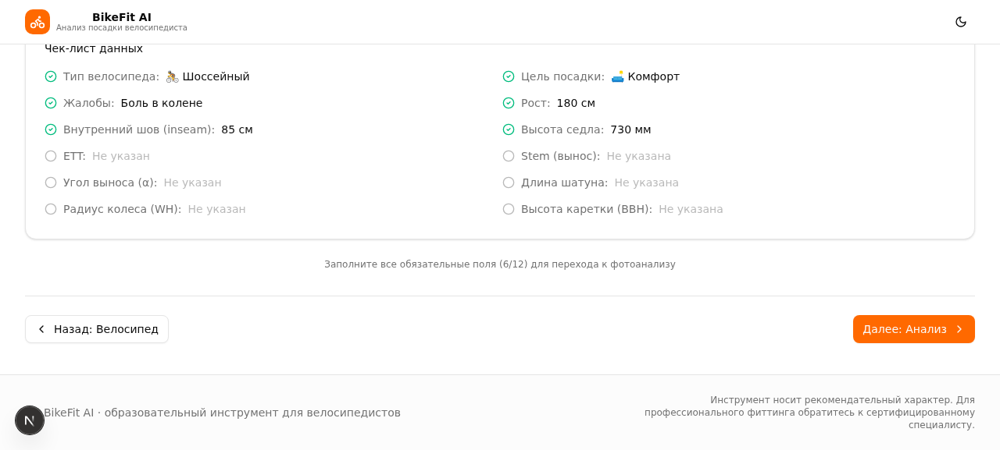
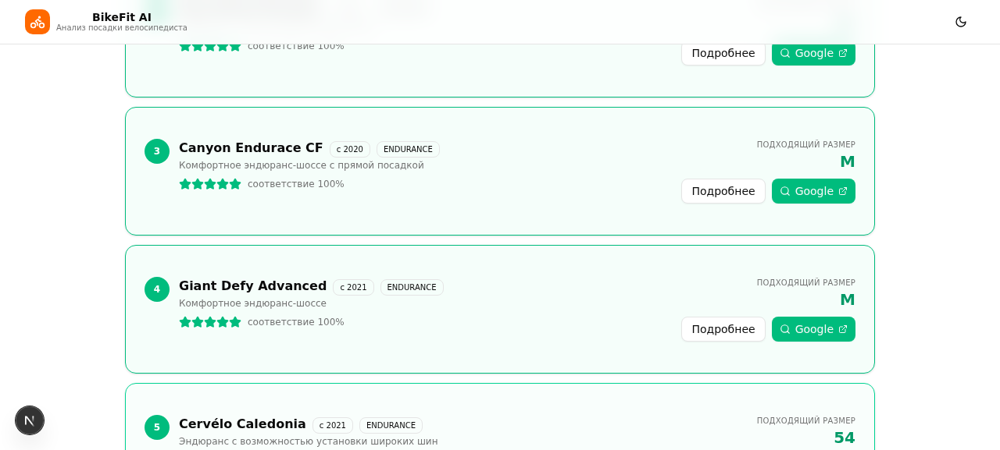

# 🚴 BikeSnap

**AI-анализ посадки на велосипеде и подбор геометрии рамы — прямо в браузере.**

BikeSnap помогает велосипедистам настроить посадку под своё тело и цели, а также подобрать модель велосипеда с подходящей геометрией — без поездок в студию bike-fitting. Загрузите фото, введите пару измерений — получите целевые параметры и конкретные рекомендации.

<p align="center">
  
  
</p>

---

## ✨ Возможности

### Режим 1 — «Настроить мой велосипед» (5 шагов)

1. **Контекст** — тип велосипеда (шоссе / грэвел / MTB / гибрид / городской), цель посадки (комфорт / спорт / гонки) и жалобы (боль в колене, онемение кистей и т.д.).
2. **Тело** — рост, inseam, длина стопы/руки/туловища, гибкость спины. Поддержка нескольких профилей райдеров.
3. **Велосипед** — параметры текущего велосипеда (SH, WB, ETT, вынос, шатуны…) с подсказками «как измерить». Автозаполнение по фото: загрузите снимок велосипеда сбоку — vision-модель распознает геометрию, либо отметьте ключевые точки вручную в интерактивном калибраторе.
4. **Сводка** — расчёт целевой геометрии (целевые SH, Reach, Stack, ETT) и готовность к анализу.
5. **Анализ** — фото/видеоанализ посадки с 3 ракурсов (сбоку / сзади / спереди) на основе MediaPipe Pose: углы суставов, оценка симметрии, сравнение «до и после».

По жалобам формируется кросс-рекомендации: какая метрика скорее всего вызывает боль и как её скорректировать.

### Режим 2 — «Подобрать раму» (4 шага)

Вводите тип, цель и параметры тела — получаете целевые Stack / Reach / ETT и список подходящих моделей (Trek, Specialized, Canyon, Cannondale, Cervélo, Giant, Merida…) с рейтингом соответствия, рекомендуемым размером и ссылкой на поиск.

<p align="center">
  
</p>

## 🛠 Технологии

| Слой | Технология |
|---|---|
| Фреймворк | [Next.js 16](https://nextjs.org/) (App Router, Turbopack) + TypeScript |
| UI | [Tailwind CSS 4](https://tailwindcss.com/) + shadcn/ui + Lucide Icons |
| Состояние | [Zustand](https://zustand.docs.pmnd.rs/) (persist в localStorage) |
| Анализ позы | [MediaPipe Tasks Vision](https://developers.google.com/mediapipe) (Pose Landmarker, WASM/WebGL, работает на клиенте) |
| Vision AI | Серверные API-роуты с vision-моделью для распознавания геометрии велосипеда по фото |
| Валидация | Zod |

Клиентская часть не требует бэкенда для базового сценария: расчёты геометрии выполняются локально, состояние хранится в браузере.

## 🚀 Быстрый старт

Требуется Node.js 20+ (или Bun 1.2+).

```bash
git clone https://github.com/agent-slon-lab/BikeSnap.git
cd BikeSnap
npm install        # или: bun install
npm run dev        # или: bun run dev
```

Откройте [http://localhost:3000](http://localhost:3000).

### Скрипты

| Команда | Назначение |
|---|---|
| `npm run dev` | Dev-сервер на порту 3000 |
| `npm run build` | Production-сборка |
| `npm start` | Запуск production-сборки |
| `npm run lint` | ESLint |

## 🤖 AI-анализ фото велосипеда

Функции «автозаполнение по фото» и «калибровка ключевых точек» используют серверные vision-модели через [`z-ai-web-dev-sdk`](https://www.npmjs.com/package/z-ai-web-dev-sdk). SDK читает конфиг из файла `.z-ai-config`:

```json
{
  "baseUrl": "https://api.example.com/v1",
  "apiKey": "YOUR_API_KEY"
}
```

- Без настроенного конфига приложение **работает корректно**: соответствующие API-роуты возвращают `503` с понятным сообщением, а параметры можно ввести вручную или отметить точки на фото в ручном калибраторе.
- Файл `.z-ai-config` не коммитится (в `.gitignore`). Анализ позы (MediaPipe) работает без каких-либо ключей — полностью на клиенте.

## ☁️ Деплой на Vercel

Проект разворачивается одной кнопкой — никаких переменных окружения для базовой работы не нужно:

1. Fork или импорт репозитория в Vercel.
2. Framework preset: **Next.js** (определяется автоматически).
3. Build command / Output — по умолчанию (`next build`).
4. Deploy.

[](https://vercel.com/new/clone?repository-url=https://github.com/agent-slon-lab/BikeSnap)

> Если нужен AI-анализ фото велосипеда на своём хостинге — добавьте `.z-ai-config` через переменную окружения / секреты платформы и примонтируйте файл, либо адаптируйте `src/app/api/*` под вашего vision-провайдера (OpenAI-совместимый API).

## 📁 Структура проекта

```
src/
├── app/
│   ├── page.tsx                     # Единственный UI-роут (мастер онбординга)
│   ├── layout.tsx                   # Метаданные, тема (next-themes)
│   └── api/
│       ├── analyze-bike-photo/      # Vision AI: параметры геометрии по фото
│       └── calibrate-bike-photo/    # Vision AI: ключевые точки на фото
├── components/
│   ├── bike-fit/                    # 21 компонент мастера (шаги, анализаторы, рекомендации)
│   └── ui/                          # shadcn/ui
├── hooks/                           # use-pose-landmarker (MediaPipe) и др.
└── lib/
    ├── bike-calculations.ts         # Расчёт целевой геометрии (SH, Reach, Stack…)
    ├── bike-fit.ts                  # Анализ посадки по landmark'ам
    ├── bike-models.ts               # База моделей велосипедов
    ├── bike-complaints.ts           # Жалобы → причины → корректировки
    ├── bike-perspective.ts          # Учёт перспективы и типоразмеров колёс
    ├── bike-store.ts                # Zustand store (persist)
    └── …                            # масштабирование фото, валидация, диагностика
```

## 📊 Как это считается

- **Целевая геометрия** строится от inseam и типа велосипеда: SH ≈ inseam × коэффициент (зависит от цели и типа), далее Reach/Stack из пропорций туловища и рук с поправкой на гибкость и жалобы.
- **Анализ позы** использует углы в суставах (колено, бедро, плечо, локоть, шея) из Pose Landmarker в ключевых фазах педалирования (НМТ/ВМТ) и сравнивает их с референсными диапазонами.
- Все расчёты — **образовательная оценка**, а не замена профессионального bike-fitting.

Подробная история изменений — в [CHANGELOG.md](CHANGELOG.md).

## ⚠️ Дисклеймер

BikeSnap — образовательный инструмент. Рекомендации носят информационный характер и не заменяют консультацию сертифицированного специалиста по bike-fitting или врача.

## 📄 Лицензия

[MIT](LICENSE)
